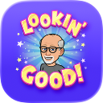

# Mastering PreviewTraits



A comprehensive SwiftUI demonstration project showcasing the power of PreviewTraits for efficient iOS development and testing. This starter project accompanies the video tutorial series on mastering PreviewTraits.

## 📺 Video Tutorial

<a href="http://www.youtube.com/watch?feature=player_embedded&v=zrqFczU1iFg" target="_blank"></a>

## 🎯 What You'll Learn

This project demonstrates six essential categories of PreviewTraits:

1. **Orientation Traits** - Test layouts in portrait and landscape orientations
2. **Layout Traits** - Experiment with different size classes and device layouts
3. **Assistive Access Traits** - Ensure accessibility compliance in your designs
4. **Convenience Traits** - Quickly preview dark mode, dynamic type sizes, and color schemes
5. **Mock Network Traits** - Test network-dependent views with mock data
6. **Mock SwiftData Traits** - Preview SwiftData-powered views with sample data

## ✨ Features

- **Modern SwiftUI Patterns**: Uses `@Observable` macro instead of ObservableObject
- **SwiftData Integration**: Full CRUD operations with persistent storage
- **Image Support**: TodoItems can include photos using PhotosPicker
- **Rich Text Content**: Optional descriptions for detailed todo entries
- **Component Architecture**: Properly separated views (TodoRow, AddTodoSheet) for maintainability
- **Custom Preview Traits**: Reusable preview configurations for consistent testing
- **No Dependencies**: Pure SwiftUI/SwiftData project without external packages

## 🚀 Getting Started

### Requirements

- Xcode 15.0 or later
- iOS 17.0 or later
- macOS Sonoma or later

### Running the Project

1. Clone this repository
2. Open `PreviewTraitsDemo.xcodeproj` in Xcode
3. Select your target device or simulator
4. Press `Cmd+R` to build and run

### Exploring Previews

Each demo view includes multiple preview configurations. To see them:

1. Open any numbered Swift file (e.g., `1. Orientation Traits.swift`)
2. Enable the Canvas in Xcode (`Cmd+Option+Return`)
3. Explore different preview variants showing various traits in action

## 📁 Project Structure

```text
PreviewTraitsDemo/
├── PreviewTraitsDemoApp.swift     # App entry point with environment setup
├── 0. StartTab.swift              # Tab-based navigation container
├── 1. Orientation Traits.swift    # Orientation preview examples
├── 2. Layout Traits.swift         # Layout configuration examples
├── 3. AssistiveAccess Trait.swift # Accessibility preview examples
├── 4. Convenience Traits.swift    # Theme and type size examples
├── 5. Mock Network Trait.swift    # Network mocking examples
├── 6. Mock SwiftData.swift        # SwiftData mocking examples
└── Services/
    ├── NavigationManager.swift    # Tab navigation state management
    └── NetworkService.swift       # Mock network service
```

## 🔑 Key Concepts

### Environment Injection

The app uses Swift's modern `@Observable` macro for state management and injects dependencies via `.environment()`:

```swift
@State private var navigationManager = NavigationManager()
@State private var networkService = NetworkService()

WindowGroup {
    StartTab()
        .environment(navigationManager)
        .environment(networkService)
}
.modelContainer(for: TodoItem.self)
```

### SwiftData Integration

The TodoItem demo showcases rich SwiftData features:

- **Text and Images**: Stores todo titles, descriptions, and images
- **Optional Properties**: Demonstrates nullable fields in SwiftData models
- **PhotosPicker**: Modern image selection with async data loading
- **Component Architecture**: TodoRow and AddTodoSheet components prevent compiler timeouts

```swift
@Model
class TodoItem {
    var title: String
    var todoDescription: String?   // Optional description
    var imageData: Data?            // Image storage
    var isCompleted: Bool
    var createdAt: Date
}
```

### Custom Preview Traits

The project demonstrates how to create and use custom preview traits for consistent testing across your SwiftUI views. Custom traits include:

- `.navigationTrait(selected:)` - Set initial navigation state
- `.mockNetworkService` - Inject mock network data
- `.mockData` - Populate SwiftData with sample todos
- `.darkMode` - Quick dark mode testing
- `.dynamicTypeSize(_:)` - Test accessibility text sizes

## 💡 Tips

- Use `Cmd+B` to build the project
- Navigate between tabs using the ellipsis menu in the top-right corner
- Each view demonstrates different preview trait configurations
- Check the preview code to learn how to implement traits in your own projects

## 🙏 Support

If you want to support my work, you can:

<a href='https://ko-fi.com/Z8Z22WRVG' target='_blank'></a>

## 📱 Connect

- [Mastodon](https://iosdev.space/@StewartLynch)
- [Threads](https://www.threads.net/@stewartlynch)
- [Bluesky](https://bsky.app/profile/stewartlynch.bsky.social)
- [X (Twitter)](https://x.com/StewartLynch)
- [LinkedIn](https://linkedin.com/in/StewartLynch)
- [YouTube](https://youTube.com/@StewartLynch)

## 📄 License

Copyright © 2026 CreaTECH Solutions (Stewart Lynch). All rights reserved.
